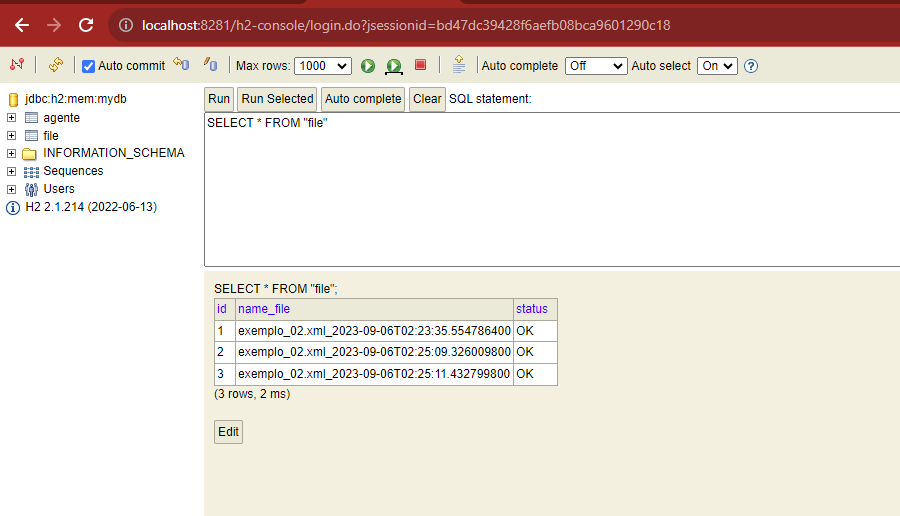
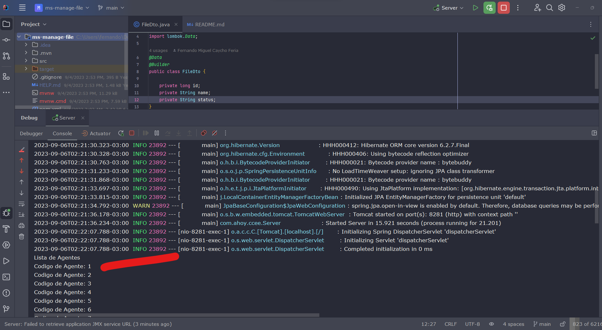
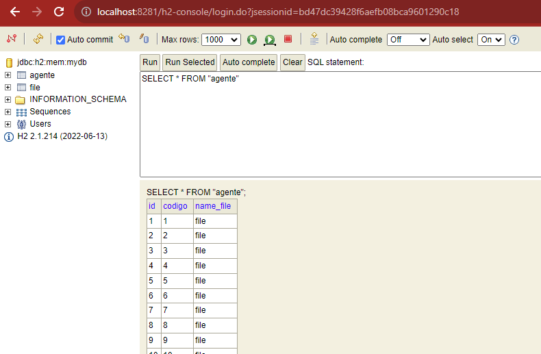
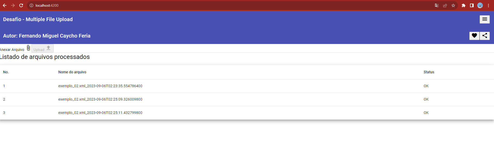
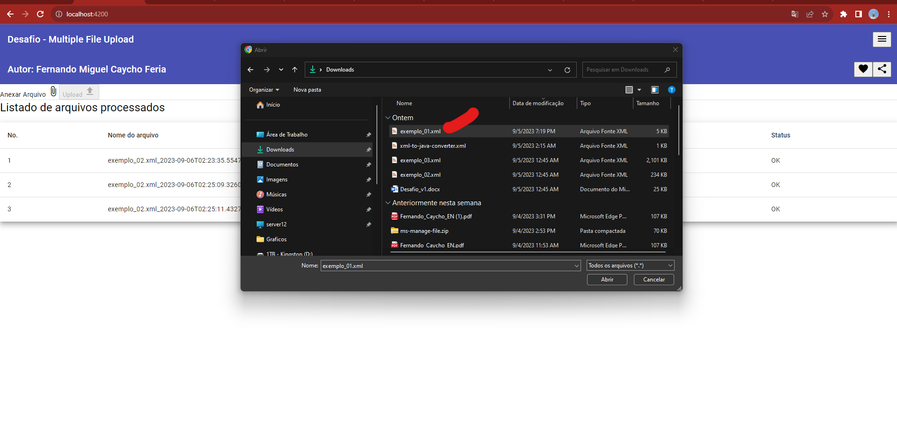
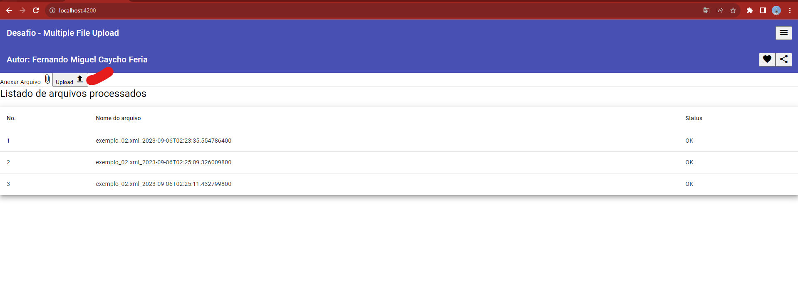
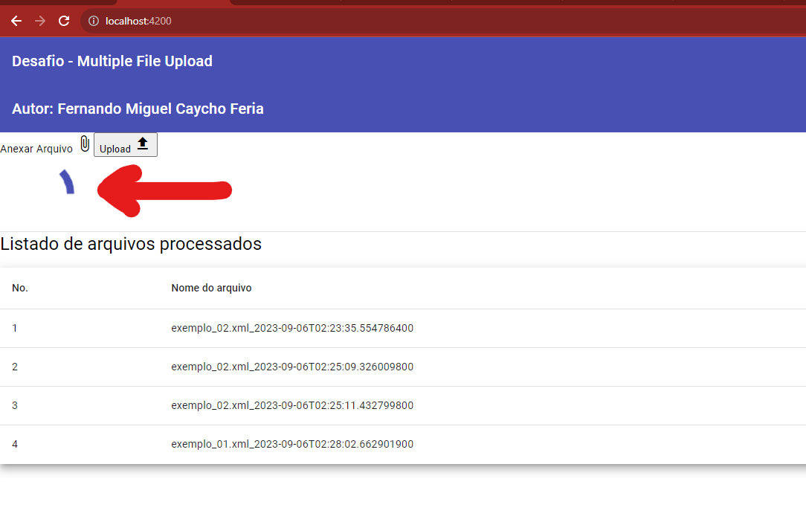

# ahoy
### Autor: Fernando Miguel Caycho Feria
- [OCJP](https://www.youracclaim.com/badges/fdad74d8-20a3-4a61-8e60-2fe273ea12ff/linked_in_profile)
- [OCJWS](https://www.credly.com/badges/843dabc3-06cc-4e5e-af98-fde6132ae9fb/linked_in_profile)
- [AWS](https://www.credly.com/badges/b2cd8608-12d2-4f5d-b6d7-476a1f9c5342/public_url)
- [Linkedin](https://www.linkedin.com/in/fernandomiguelcaychoferia/)

## Requirements

For building and running the application you need:

- [JDK 20](https://www.oracle.com/java/technologies/downloads/#jdk20-windows)
- [Maven 3](https://maven.apache.org)

## Running the application locally

There are several ways to run a Spring Boot application on your local machine. One way is to execute the `main` method in the `de.codecentric.springbootsample.Application` class from your IDE.

Alternatively you can use the [Spring Boot Maven plugin](https://docs.spring.io/spring-boot/docs/current/reference/html/build-tool-plugins-maven-plugin.html) like so:

```shell
mvn spring-boot:run
```
## Deploying the application to OpenShift

The easiest way to deploy the sample application to OpenShift is to use the [OpenShift CLI](https://docs.openshift.org/latest/cli_reference/index.html):

```shell
oc new-app codecentric/springboot-maven3-centos~https://github.com/codecentric/springboot-sample-app
```

This will create:

* An ImageStream called "springboot-maven3-centos"
* An ImageStream called "springboot-sample-app"
* A BuildConfig called "springboot-sample-app"
* DeploymentConfig called "springboot-sample-app"
* Service called "springboot-sample-app"

If you want to access the app from outside your OpenShift installation, you have to expose the springboot-sample-app service:

```shell
oc expose springboot-sample-app --hostname=www.example.com
```


### Database H2


### Back-end: Imprimindo codigo de Agente



### Front-end: Angular






